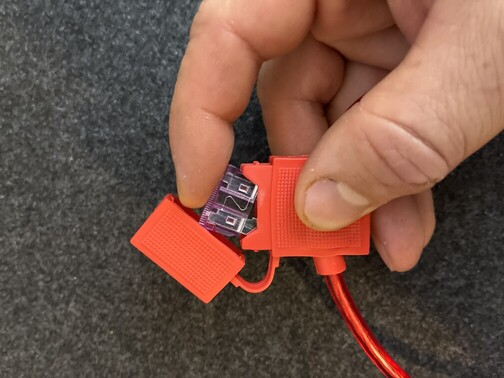
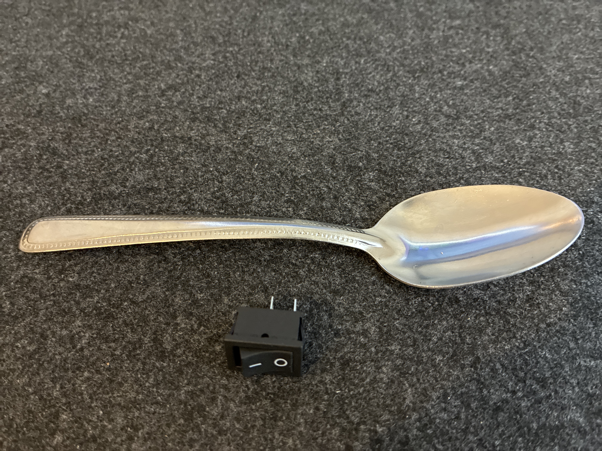
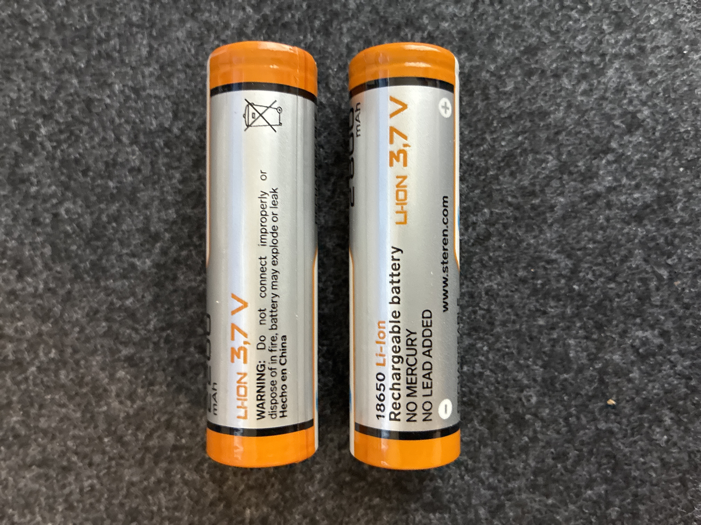
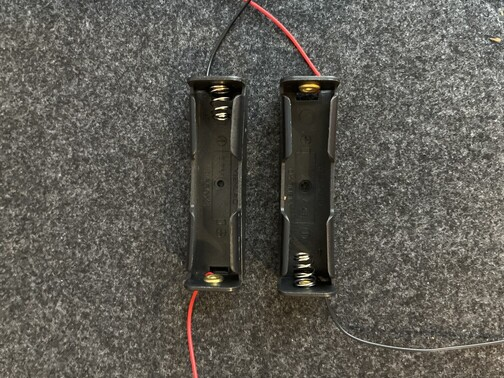
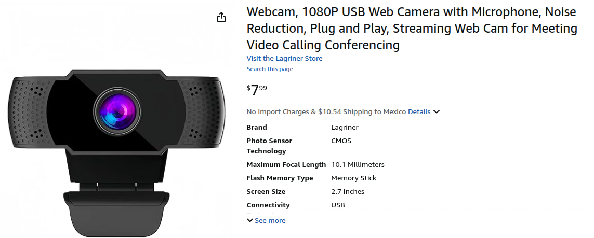
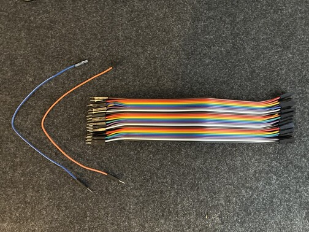
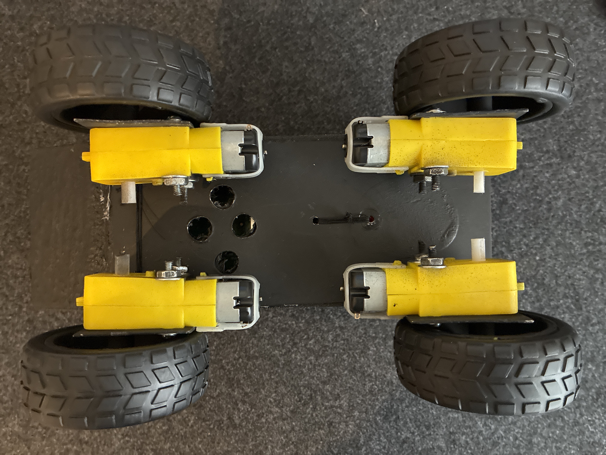
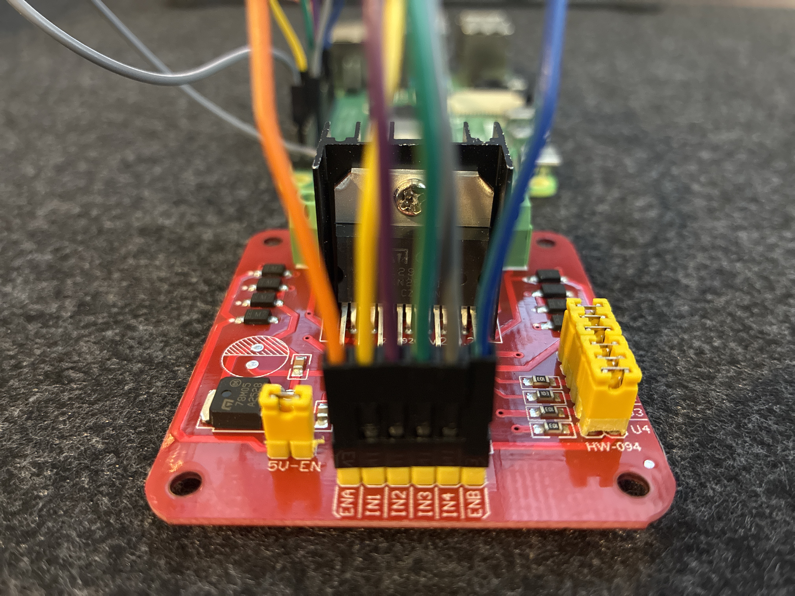
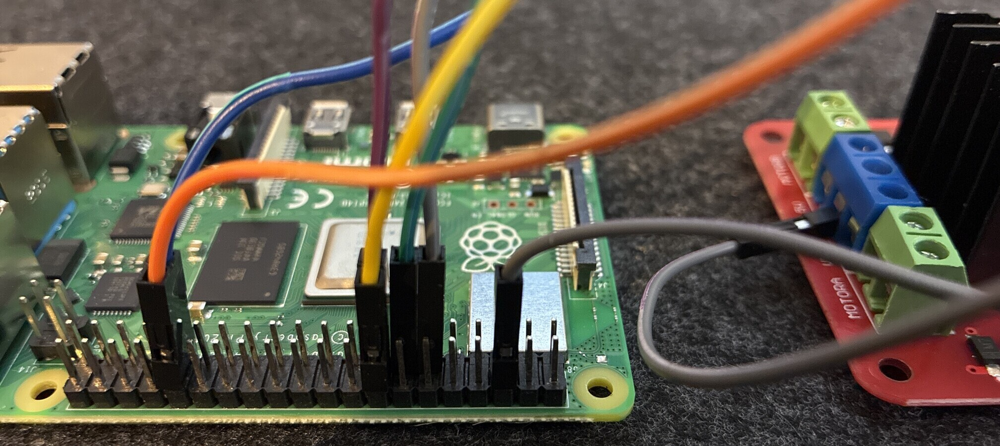

# IRL Robot Setup (differential drive) 

By the end of this instructional you will have built **your own differential drive robot**, controllable via WiFi with your keyboard and ready for autonomous functions

 

 

## MATERIALS :gear:

## ONE Raspberry Pi 4 with 4 gigs of RAM (we used Model B)

 

## ONE L298N Motor Controller

 
 
(depicted above is one example of a viable option, your motor controller may look different)

## ONE power bank or portable phone charger (at least 10,000 mAh, QC at least 18W, PD at least 18W),  **must include USB to type-c charge cable**) 

 
(depicted above is one example of a viable option, your power bank may look different)

## ONE fuse holder **with at least one 5W fuse** (can be for car, motorcycle, or other type of machine)

 
 
(depicted above is one example of a viable option, your fuse and fuse holder may look different)

## ONE simple ON /OFF switch 

 
 
(depicted above is one example of a viable option, your ON / OFF switch may look different)

## TWO 3.7V 18650 Li-ion battery (at least 2,200 mAh) (make sure to get the bettery charger!)

 
 
(depicted above is one example of a viable option, your batteries may look different)

## ONE battery holder for your two 18650 Li-ion batteries **or two battery holder each for oneindividual battery**

 
 
(depicted above is one example of a viable option, your batteries may look different)

## ONE USB webcam 

 
 
(depicted above is one example of a viable option, your webcam may look different)

## ONE PACK of female-to-female jumper cables 

 
 
(depicted above is one example of a viable option, your jumper cables may look different)

## ONE PACK of male-to-female jumper cables

**NOTE:** The female side of these jumper cables will be cut off, so **male-to-male jumper cables would also work here**
**HOWEVER**, you will definitely need at least one female-to-male jumper cable to connect the GND on the Pi to GND on the motor controller

 
 
(depicted above is one example of a viable option, your jumper cables may look different)

## ONE chassis with **FOUR** DC gear motors (make sure to buy a wheel for each motor, 4 total)

**These DC gear motors are easy to find at hobby shops**.  You can make your own chassis or buy an assembled chassis that already includes four motors similar to the yellow DC gear motors depicted below

 
 
(depicted above is one example of a viable option, your chassis may look different)

We will not include instructions on how to make your own chassis, these can be bought ready-made or assembled easily from a small rectangle of sheet metal and some simple tools. 

The outer shell of the robot in the GIF was made using a 3D printer, but this can be made by hand or made from a recycled plastic shell of any kind.

 

## TOOLS :toolbox:

Almost all of these tools can be replaced with basic household items, but we will include this list of tools for those who have them on-hand

**at least ONE** pair of tweezers to hold wires steady within the robot during final build steps

**ONE** screwdriver set, or a screwdriver with a tip small enough for M2, M2.5, or M3 screws (these screws will be used to attach your pi and your motor controller to your chassis, if you dedice to connect these components to the chassis in another way then the screwdriver will not be needed)

**ONE** wire stripper (or a nail clipper and very steady hands) 

**ONE** hot silicone gun (or any thick adhesive)

 

## GPIO Pin Setup

The GPIO pins on the Raspberry Pi will connect to the pins on your L298N Motor Controller.  The controler used in this tutorial has pin labels **ENA, IN1, IN2, IN3, IN4, and ENB**.  These are the controler pins that look like the GPIO pins on your Raspberry Pi.  If your controler's pin labels are different, check the list below to see which of your pins 

**ENA** is sometimes labeled as **EN A**, **EA**, **PWM_A**, **PWMA**, **EN1**, or **ENABLE_A**

**ENB** is also sometimes labeled as **ENB**, **EN B**, **EB**, **PWM_B**, **PWMB**, **EN2**, **ENABLE_B**

**IN1** is sometimes labeled as **INA1**, **AIN1**, or **I1**

**IN2** is sometimes labeled as **INA2**, **AIN2**, or **I2**

**IN3** is sometimes labeled as **INA3**, **AIN3**, or **I3**

**IN4** is sometimes labeled as **INA4**, **AIN4**, or **I4**

### Connect the following pins on the motor controller to the folowing pins on the Raspberry Pi:

**ENA** to ****
**ENB** to ****
**IN1** to ****
**IN2** to ****
**IN3** to ****
**IN4** to ****

These connections are depicted below:

 

The GPIO pins connected to the motor controller will be referenced in our code:

 

