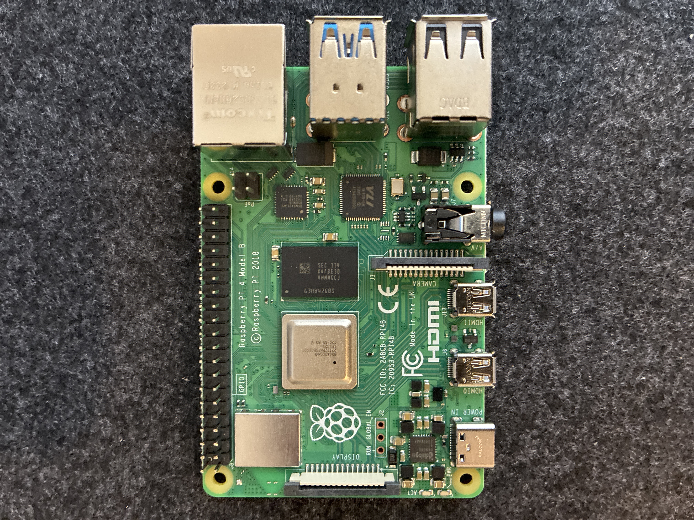
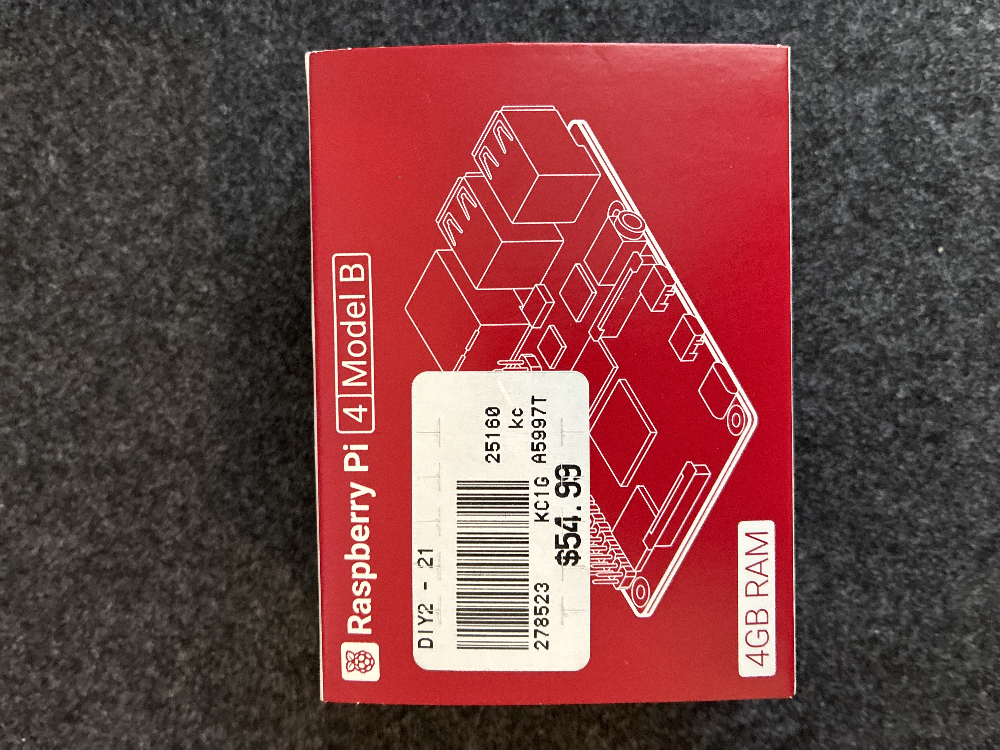
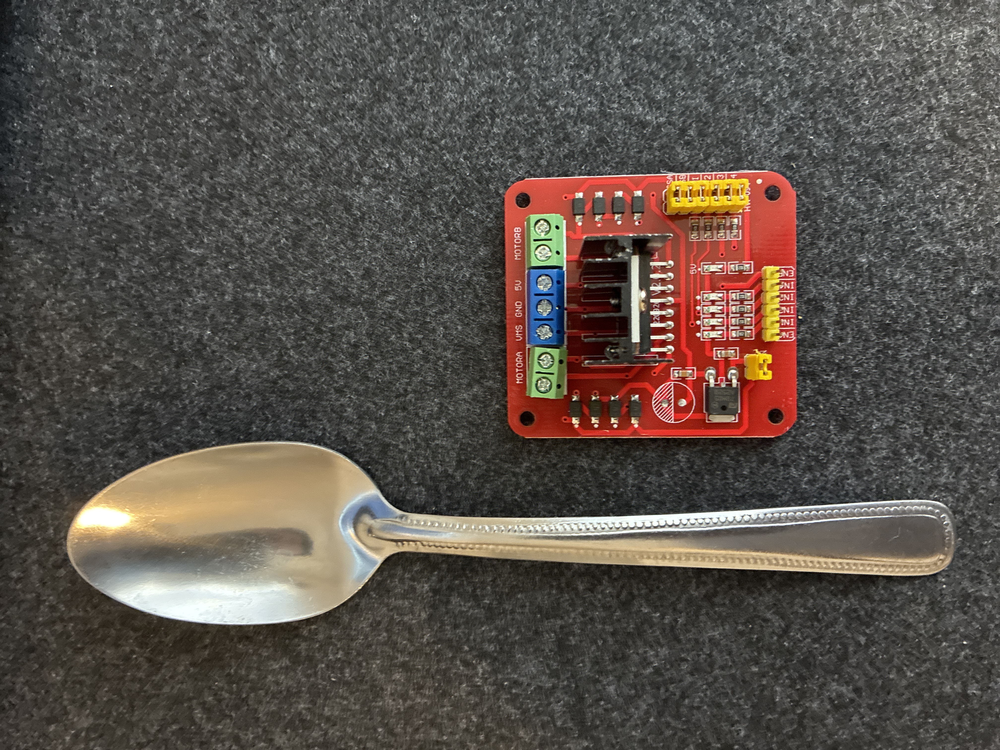
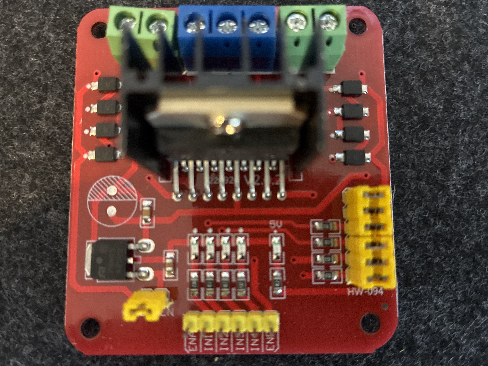
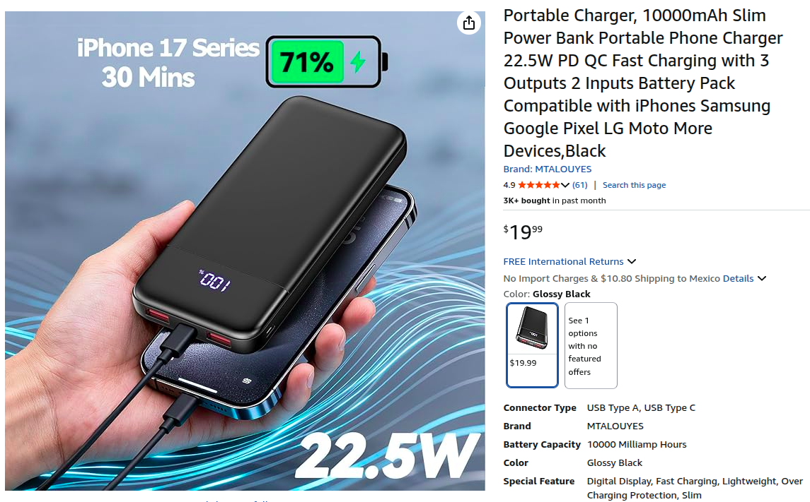

# IRL Robot Setup (differential drive) 

By the end of this instructional you will have built **your own differential drive robot**, controllable via WiFi with your keyboard and ready for autonomous functions

 

 

## MATERIALS :gear:

## ONE Raspberry Pi 4 with 4 gigs of RAM (we used Model B)

 

## ONE L298N Motor Controller

 

(depicted above is one example of a viable option, your motor controller may look different)

## ONE power bank or portable phone charger (at least 10,000 mAh, QC at least 18W, PD at least 18W),  **must include USB to type-c charge cable**) 

(depicted above is one example of a viable option, your power bank may look different)

## ONE fuse holder **with at least one 5W fuse** (can be for car, motorcycle, or other type of machine)

(depicted above is one example of a viable option, your fuse and fuse holder may look different)

## ONE simple on/off switch 

## TWO 3.7V 18650 Li-ion battery (at least 2,200 mAh)

## ONE battery holder for your two 18650 Li-ion batteries **or two battery holder each for oneindividual battery**

## ONE USB webcam 

## ONE PACK of male-to-female jumper cables 

## ONE PACK of female-to-female jumper cables

## ONE chassis with **FOUR** DC gear motors (easy to find at hobby shops)

We will not include instructions on how to make your own chassis, these can be bought ready-made or assembled easily from a small rectangle of sheet metal and some simple tools. 

The outer shell of the robot in the GIF was made using a 3D printer, but this can be made by hand or made from a recycled plastic shell of any kind.

 

## Tools :toolbox:

Almost all of these tools can be replaced with basic household items, but we will include this list of tools for those who have them on-hand

**ONE** wire stripper (or a nail clipper and very steady hands) 

**ONE** hot silicone gun (or any thick adhesive)

 

## GPIO Pin Setup

The GPIO pins on the Raspberry Pi will connect to the pins on your L298N Motor Controller.  The controler used in this tutorial has pin labels **ENA, IN1, IN2, IN3, IN4, and ENB**.  These are the controler pins that look like the GPIO pins on your Raspberry Pi.  If your controler's pin labels are different, check the list below to see which of your pins  

