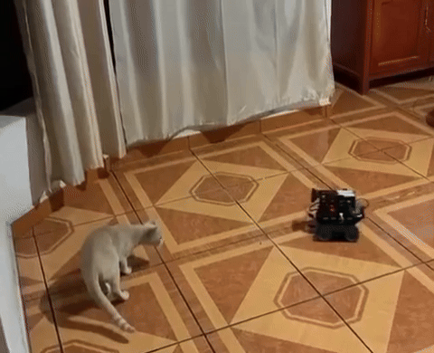

# IRL Robot Setup (differential drive)

### By the end of this instructional you will have built your own differential drive robot, controllable via WiFi with your keyboard and ready for autonomous functions

 

 

## Materials and Tols

